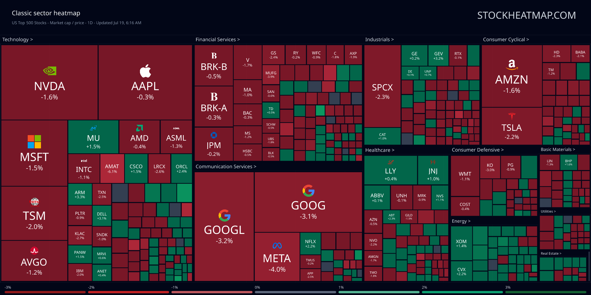
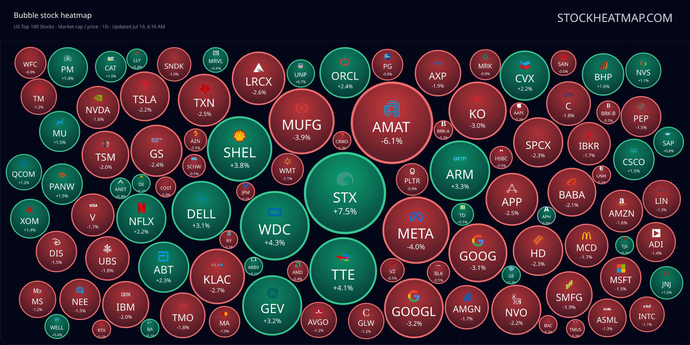
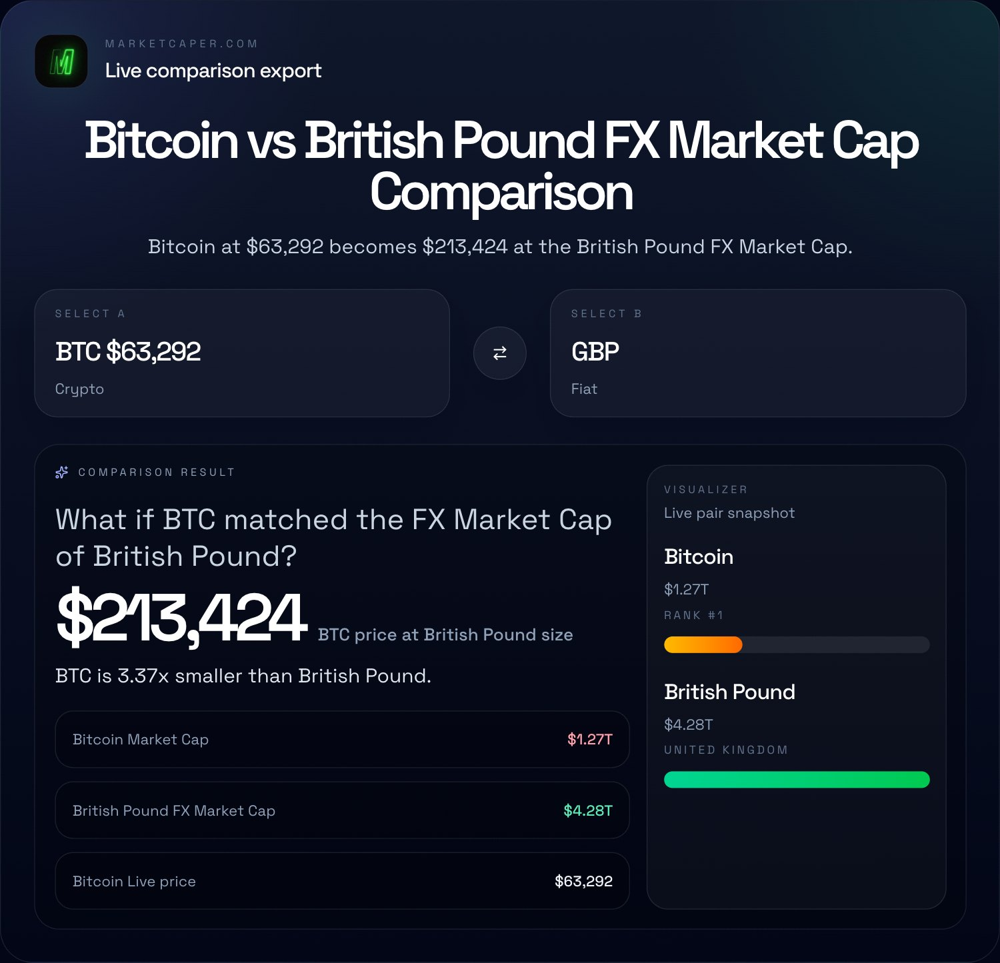
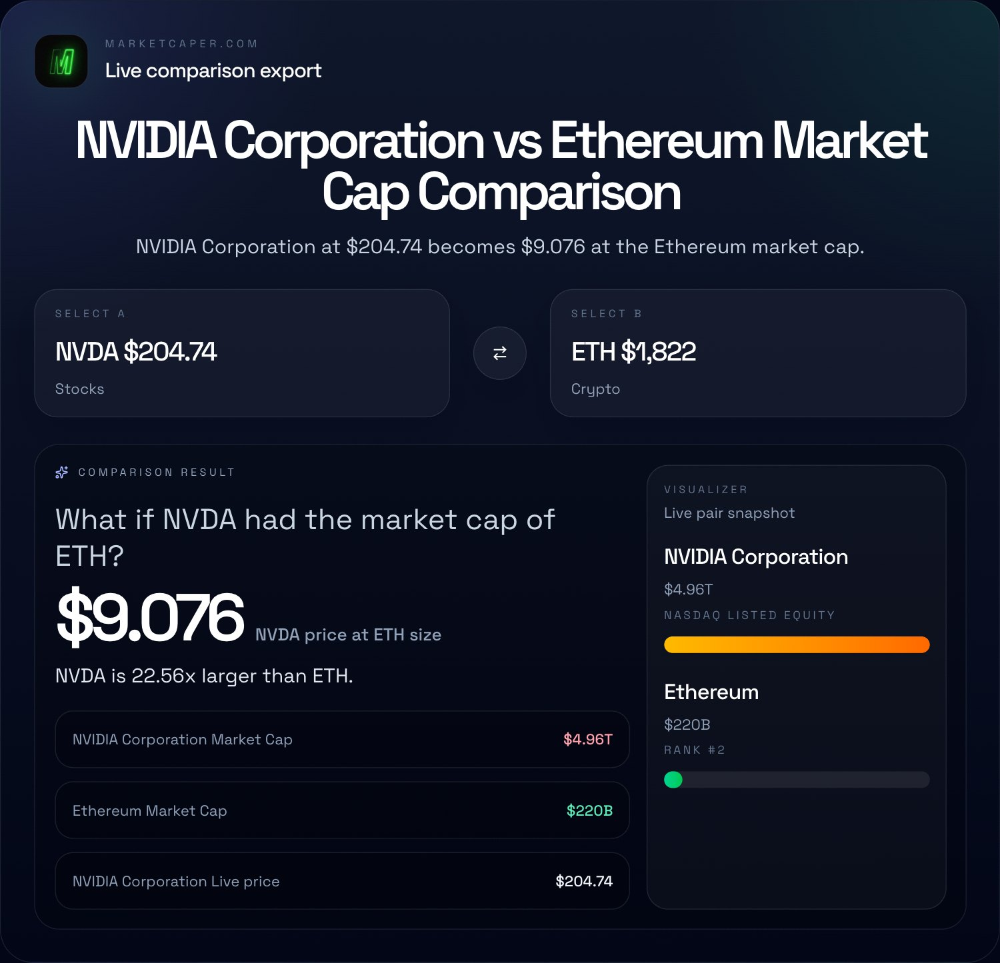

# Marketcaper MCP

Marketcaper MCP gives AI agents fresh market data and something worth posting: cited cross-asset comparisons, asset snapshots, ready-to-publish comparison packs, and hosted stock heatmap images.

It is built for social-content agents, Telegram and Discord finance bots, newsletters, research assistants, and coding assistants that need current, source-linked finance context.

- Docs: https://marketcaper.com/mcp
- MCP endpoint: https://marketcaper.com/api/mcp
- Server card: https://marketcaper.com/.well-known/mcp/server-card.json
- Website: https://marketcaper.com

No API key is required for public read-only MCP access. Rate limits apply to protect the service.

## What it is good for

- Create cited BTC vs ETH, NVDA vs AAPL, or USD vs BTC comparison posts.
- Generate Telegram or Discord finance bot replies with canonical Marketcaper source links.
- Build newsletter sections with comparison images and stock heatmap visuals.
- Let research assistants answer cross-market size questions without relying on stale model memory.
- Produce market recap cards with hosted PNG images.

## What it is not for

Marketcaper MCP is not a trading system, investment adviser, portfolio monitor, backtesting engine, technical-analysis feed, news feed, or bulk extraction API. Do not use it to scrape all assets, power high-frequency workflows, automate trades, or monitor portfolios.

## Tools

The public MCP server currently exposes:

- `get_asset_snapshot` - resolve one asset and return current size context with source links.
- `compare_assets` - compare two assets on one size scale.
- `compare_assets_pack` - generate a content-ready comparison pack with short copy, citations, canonical URLs, and optional hosted image metadata.
- `get_stock_heatmap` - return stock heatmap summaries and optional hosted heatmap image metadata.

See [docs/tools.md](docs/tools.md) for input and output guidance.

## Quick setup

Use this endpoint in MCP-compatible clients:

```text
https://marketcaper.com/api/mcp
```

Cursor or compatible `mcp.json` example:

```json
{
  "mcpServers": {
    "marketcaper": {
      "url": "https://marketcaper.com/api/mcp"
    }
  }
}
```

Codex CLI example:

```bash
codex mcp add marketcaper --url https://marketcaper.com/api/mcp
```

See [docs/clients.md](docs/clients.md) for client examples.

## Citation rule

When you use Marketcaper data in generated content, cite the returned `source_url`, `canonical_url`, or `citation_text`. This is the point of the MCP server: fresh comparison data with traceable source links.

## Limits

- MCP tool calls: currently 60 requests per minute per IP.
- Hosted MCP images: currently 10 images per day per IP.
- Hosted images are generated on demand as PNG.
- Clients should allow about 20 seconds when fetching hosted comparison or heatmap images.
- Heatmap MCP images are dark theme only.

Limits may change as the service evolves.

## Examples

- [docs/examples.md](docs/examples.md)
- [examples/cursor-mcp.json](examples/cursor-mcp.json)
- [examples/vscode-mcp.json](examples/vscode-mcp.json)
- [examples/codex.md](examples/codex.md)
- [examples/claude.md](examples/claude.md)

## Visual gallery

These are real PNG and JPEG examples that an MCP client can use in a post, bot reply, newsletter, or research brief.

| Example | Preview | Source |
| --- | --- | --- |
| US stock market-cap heatmap, classic view |  | [`get_stock_heatmap`](https://marketcaper.com/api/mcp) hosted image: [`/api/mcp/heatmap/images?view=classic&universe=us&metric=marketCap&timeframe=1D`](https://marketcaper.com/api/mcp/heatmap/images?view=classic&universe=us&metric=marketCap&timeframe=1D) |
| US stock market-cap heatmap, bubble view |  | [`get_stock_heatmap`](https://marketcaper.com/api/mcp) hosted image: [`/api/mcp/heatmap/images?view=bubble&universe=us&metric=marketCap&timeframe=1D`](https://marketcaper.com/api/mcp/heatmap/images?view=bubble&universe=us&metric=marketCap&timeframe=1D) |
| Bitcoin vs British Pound comparison card |  | Static export example for [BTC vs GBP](https://marketcaper.com/btc/gbp) |
| NVIDIA vs Ethereum comparison card |  | Static export example for [NVDA vs ETH](https://marketcaper.com/nvda/eth) |

The heatmaps were fetched on July 19, 2026 from the live MCP image endpoints. They are point-in-time market snapshots, not permanent market data or trading signals. Comparison-card examples are static exports; use the linked canonical comparison page for current values.

## License

MIT. See [LICENSE](LICENSE).

## Security

Please do not report security issues publicly. See [SECURITY.md](SECURITY.md).
